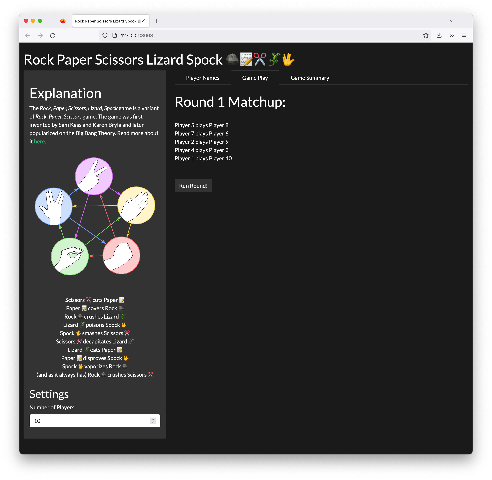

## Intro

A friendly R package for simulating rock-paper-scissors-lizard-spock games! 

```r
# To Install
devtools::install_github("ctesta01/RPSLS")
```

## Explanation 

The *Rock, Paper, Scissors, Lizard, Spock* game is a variant
of *Rock, Paper, Scissors* game invented by Sam Kass and Karen Bryla with Spock signified using the Star Trek Vulcan salute, and lizard sometimes shown in diagrams by forming the hand into a sock-puppet-like mouth [^1]. The following diagram from Wikimedia[^2] explains how each game is resolved.  See the output of `explain_the_game()` below for the logic behind the diagram.


```{r, message=FALSE}
library(RPSLS)
```

```{r}
explain_the_game()
```

## Sampling the Elements

```{r}
sample_rpsls()
sample_rpsls(2)
```

# Playing a Game

Two players can use the `sample_rpsls_pair` function
to simulate a single-game between two people.  The
result can be that player 1 wins, player 2 wins, or
they tie.

```{r}
sample_rpsls_pair()
```

## Tournaments

The app can be run after installing the package, loading it, and calling `app()`.



## Citations

[^1]: Rock, Paper Scissors. https://en.wikipedia.org/wiki/Rock_paper_scissors
[^2]: A resolution diagram of the game *Rock, Paper, Scissors, Lizard, Spock*. https://en.wikipedia.org/wiki/File:Pierre_ciseaux_feuille_l%C3%A9zard_spock_aligned.svg
